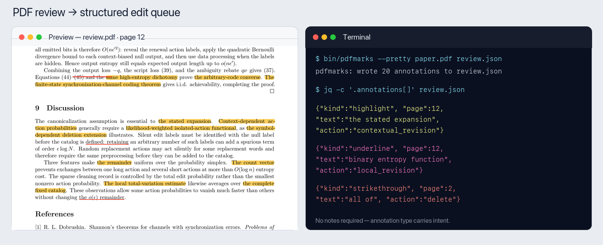

# styleck

`styleck` helps a human and an editing agent revise mathematical papers. It
turns PDF markup into a structured edit queue and checks the resulting LaTeX
for common writing problems. It reads source files only: it never compiles a
paper or participates in a LaTeX build.



## Quick start

The source checker requires Python 3. The PDF annotation extractor requires
macOS because it uses Preview's PDFKit annotations.

```sh
# Optional: make the commands available everywhere
ln -s /absolute/path/to/style/bin/styleck /usr/local/bin/styleck
ln -s /absolute/path/to/style/bin/pdfmarks /usr/local/bin/pdfmarks

styleck paper.tex
styleck --fix paper.tex
```

`styleck` reports errors and warnings with a rule id. `--fix` applies only
mechanical repairs. To see the rule behind a finding, run
`styleck --rules RULE-ID paper.tex`; to print the full writing guide, run
`styleck --docs`.

## Review a PDF

In Preview, use three markup tools without writing notes:

- **Highlight**: something is wrong; inspect the surrounding argument and
  revise it.
- **Underline**: make a local repair while preserving the intended meaning.
- **Strikethrough**: delete the selected text.

Save the annotated PDF, then extract it immediately:

```sh
pdfmarks --pretty review.pdf review.json
```

The JSON records the selected text, page, nearby text, annotation type, and
optional note. A useful instruction to an editing agent is:

> Read `review.json` and reconcile every annotation against the current
> `.tex`. Treat stale annotations as intent rather than literal locations.

Extract before rebuilding the PDF. A LaTeX build may replace the annotated
file and discard its embedded markup. Keep the source PDF or a timestamped
copy until the edits are accepted.

## Check a paper

```sh
styleck paper.tex                    # all findings
styleck --new-since HEAD paper.tex   # findings introduced by this change
styleck --concordance the paper.tex  # inspect every prose occurrence
```

Errors return a nonzero exit status; warnings are advisory unless
`--warn-exit` is supplied. The checker skips mathematics, comments, diagrams,
and verbatim material when applying prose rules.

### Declare assumed vocabulary

Put field-standard terms that need no local definition in `.styleck-terms`,
one per line. A source-specific `paper-name.styleck-terms` extends the project
list for `paper-name.tex`.

```text
capacity
conditional entropy
relative entropy
renewal process
```

An `@relative/path.styleck-terms` line imports another vocabulary list; an
`@relative/path.tex` line imports terms explicitly marked with `\term{...}` in
that source.

## Optional automation

The repository includes post-edit hooks for Codex and Claude Code and a Git
pre-commit hook. They report only findings introduced by the current edit, so
an older paper does not have to be cleaned all at once. See
[Automation and hooks](docs/automation.md).

For the checker architecture, rule authoring, synchronization, and tests, see
[Developing styleck](docs/development.md).
